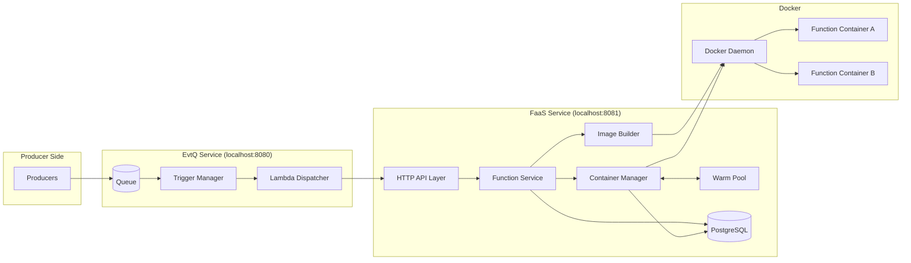
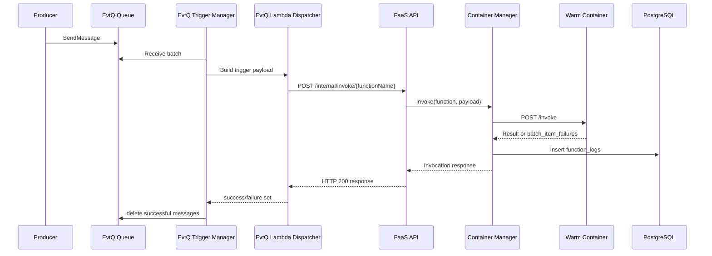
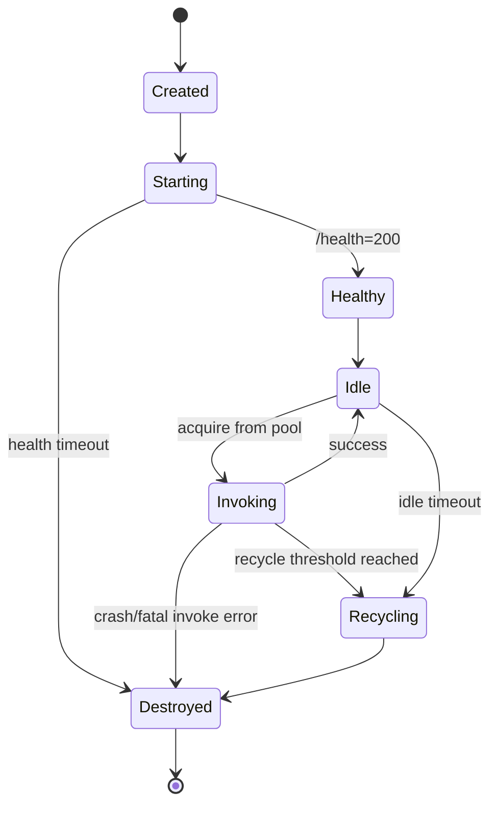

# FaaS Architecture

## Table of Contents

- [System Overview](#system-overview)
- [High-Level Architecture](#high-level-architecture)
- [Component Breakdown](#component-breakdown)
- [Invocation Flow](#invocation-flow)
- [Container Lifecycle State Machine](#container-lifecycle-state-machine)
- [Database Design Decisions](#database-design-decisions)
- [Networking Model](#networking-model)
- [EvtQ Integration Model](#evtq-integration-model)

## System Overview

FaaS is a control-plane and runtime-plane service for local serverless execution. The control-plane manages function definitions, images, and pool settings. The runtime-plane acquires containers, invokes handlers, and captures logs. EvtQ acts as the queue event source and calls FaaS through an internal Lambda-style dispatch path.

## High-Level Architecture

## Component Breakdown

- **API layer (`internal/api`)**
  - Validates requests and marshals JSON.
  - Exposes function CRUD, invoke, logs, and internal invoke endpoints.
- **Function service (`internal/service`)**
  - Applies validation defaults.
  - Builds images on create/update.
  - Coordinates runtime refresh behavior for warm pools.
- **Store (`internal/store`)**
  - PostgreSQL access for functions and logs.
  - Query paths for function lookup and logs filtering.
- **Container manager (`internal/lambda`)**
  - Creates/starts/stops/removes containers.
  - Implements cold and warm strategies.
  - Runs health checks before invocation.
  - Captures invocation logs.
- **Warm pool**
  - Buffered channel of ready containers per function.
  - Idle cleanup and recycle logic.
- **Image builder**
  - Builds runtime image tags from function code path.
  - Node: bootstrap + source copy.
  - Go: runtime-specific build path.

## Invocation Flow

## Container Lifecycle State Machine

## Database Design Decisions

- FaaS stores function metadata and logs in PostgreSQL for local operational simplicity.
- Logs are query-first, not stream-first. This keeps developer workflows simple (`curl` + SQL).
- FaaS and EvtQ can share one PostgreSQL instance with separate databases/schemas.
- Strong consistency is preferred over eventual pipelines for local determinism.

See [Design Decisions](./design-decisions.md) for rationale details.

## Networking Model

- FaaS runs on host network namespace (`localhost:8081`).
- Function containers run on a dedicated Docker bridge (`faas-net` by default).
- FaaS reaches containers over mapped localhost ports and health checks each runtime on `:8080`.
- Dedicated bridge avoids host networking and keeps runtime traffic isolated.

## EvtQ Integration Model

- EvtQ trigger dispatcher posts to `POST /internal/invoke/{functionName}`.
- Payload includes queue metadata, records, and invocation ID.
- FaaS returns success or partial failure list.
- EvtQ applies delete-on-success semantics and retries failed messages based on visibility timeout.

See [EvtQ Integration](./evtq-integration.md) and [EvtQ Concepts](../evtq/docs/concepts.md).
