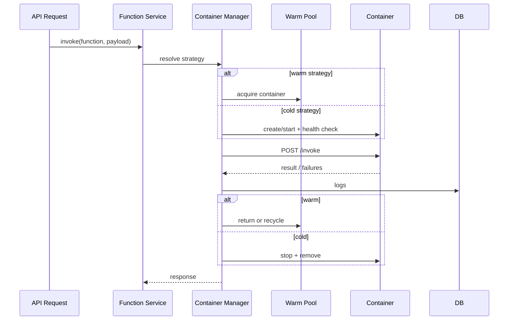

# FaaS Concepts

## Table of Contents

- [What is FaaS](#what-is-faas)
- [Functions](#functions)
- [Runtimes](#runtimes)
- [Runtime Interface Contract](#runtime-interface-contract)
- [Handler Conventions](#handler-conventions)
- [Container Strategies](#container-strategies)
- [Warm Pool Mechanics](#warm-pool-mechanics)
- [Cold Starts](#cold-starts)
- [Resource Limits](#resource-limits)
- [Invocation Lifecycle](#invocation-lifecycle)
- [EvtQ Integration](#evtq-integration)

## What is FaaS

FaaS is a local-first serverless runtime that mimics core AWS Lambda behavior: deploy function code, invoke on demand, or bind to an event source and execute automatically. It is designed for deterministic local development with explicit Docker isolation.

## Functions

A function in FaaS is:
- metadata (`name`, `runtime`, `timeout`, `memory`, strategy),
- source path on host (`code_path`),
- and a built Docker image (`image_name`).

Function execution always happens inside containers. FaaS never runs user code directly in the API process.

## Runtimes

Supported runtimes:
- **Node.js 22 (`nodejs22`)**
- **Go 1.22 (`go122`, planned runtime execution path)**

Runtime details and examples: [runtimes.md](./runtimes.md)

## Runtime Interface Contract

Each runtime container must expose:

- `GET /health` -> readiness probe (`200` means invokable)
- `POST /invoke` -> execute handler with event payload

Example invoke payload:

```json
{
  "records": [
    {
      "message_id": "550e8400-e29b-41d4-a716-446655440000",
      "body": "{\"order_id\":12345}",
      "attributes": {
        "event_type": {
          "type": "String",
          "value": "order.created"
        }
      },
      "message_group_id": "orders",
      "approximate_receive_count": 1
    }
  ],
  "source_queue": "orders.fifo",
  "invocation_id": "7c9e6679-7425-40de-944b-e07fc1f90ae7"
}
```

Success:

```json
{"status":"ok","result":{"processed":1}}
```

Partial batch failure:

```json
{
  "batch_item_failures": [
    {"item_identifier":"550e8400-e29b-41d4-a716-446655440000"}
  ]
}
```

## Handler Conventions

- **Node.js**: `exports.handler = async (event, context) => { ... }`
- **Go**: `faas-go-sdk Start(handler)` where handler receives event/context and returns result/error

## Container Strategies

### Cold
- Create/start/invoke/remove for each invocation.
- Highest isolation, highest latency.
- Good for strict stateless validation and low-frequency jobs.

### Warm
- Keep pre-started containers in a per-function pool.
- Lowest latency.
- Requires lifecycle hygiene: idle eviction and recycling.

See [Container Lifecycle](./container-lifecycle.md).

## Warm Pool Mechanics

- One pool per function.
- Pool stores healthy containers in a buffered channel.
- Invocation flow: acquire -> invoke -> return.
- Empty pool behavior: wait up to acquire timeout (configurable).
- Recycle conditions:
  - invocation threshold reached, or
  - idle timeout exceeded.

## Cold Starts

Cold start time includes:
- image pull/build cache state,
- container create/start latency,
- runtime boot,
- health check readiness.

How to reduce it:
- use warm strategy,
- keep image small,
- reduce runtime init work,
- increase warm pool size for bursty traffic.

## Resource Limits

Per container:
- memory limit (`memory_mb`),
- CPU share/limit (default `0.5`),
- PID cap (`--pids-limit`),
- read-only root filesystem,
- writable tmpfs at `/tmp`.

These defaults prioritize local safety and predictable behavior.

## Invocation Lifecycle



## EvtQ Integration

- EvtQ trigger manager reads queue batches.
- Lambda dispatcher calls FaaS internal invoke endpoint.
- Function can return `batch_item_failures`.
- EvtQ deletes successful records, retries failed ones.

For queue/trigger semantics, see [EvtQ Concepts](../evtq/docs/concepts.md). For full integration setup, see [evtq-integration.md](./evtq-integration.md).
