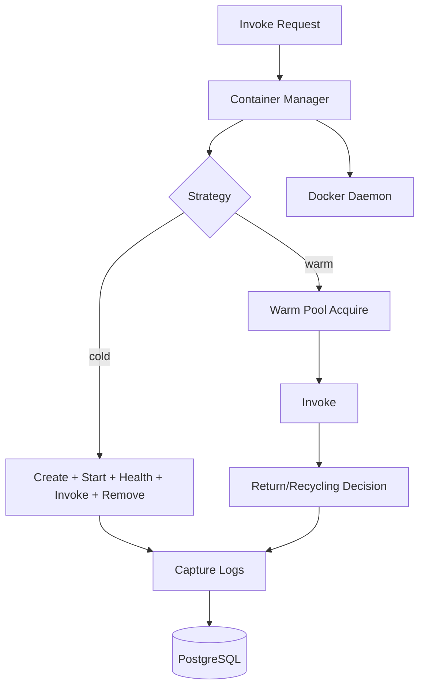
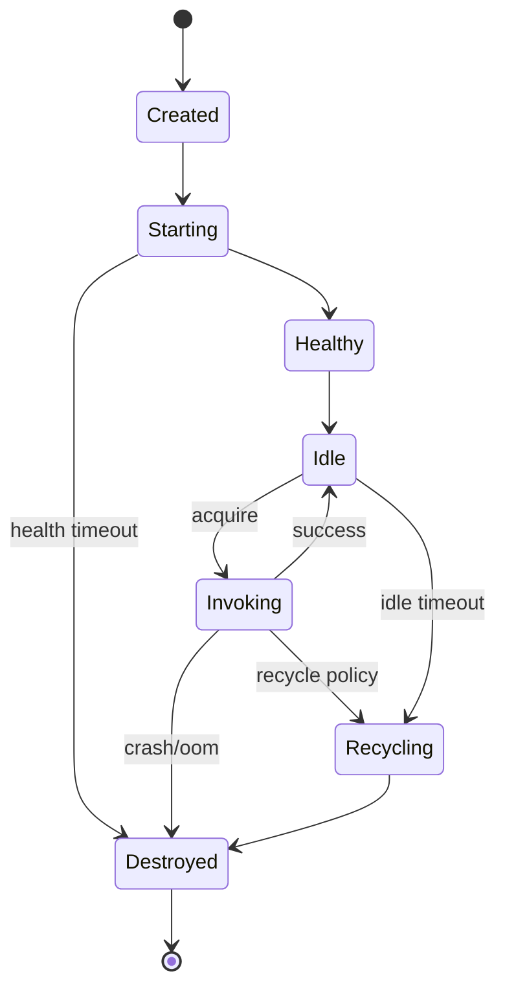

# Container Lifecycle

## Table of Contents

- [Container Manager Architecture](#container-manager-architecture)
- [Cold Start Flow](#cold-start-flow)
- [Warm Pool Flow](#warm-pool-flow)
- [Pool Sizing Guidance](#pool-sizing-guidance)
- [Container Recycling](#container-recycling)
- [Health Checks](#health-checks)
- [Resource Limits](#resource-limits)
- [Container Networking](#container-networking)
- [Cleanup Behavior](#cleanup-behavior)
- [Failure Modes](#failure-modes)
- [State Machine](#state-machine)

## Container Manager Architecture

## Cold Start Flow

1. Validate function and payload.
2. `docker create` with resource limits.
3. `docker start`.
4. Poll `GET /health` until ready or timeout.
5. `POST /invoke`.
6. Capture logs for this invocation.
7. Stop/remove container.

Typical phase ranges in local dev:
- create/start: 200-1200ms
- health readiness: 100-3000ms
- invoke: function-dependent
- teardown: 100-500ms

## Warm Pool Flow

1. Acquire pre-warmed container from channel pool.
2. Invoke handler.
3. Capture invocation logs.
4. Return container to pool or recycle it.

If pool is empty, manager waits up to acquire timeout (configurable). For details on cold fallback policy, see [configuration](./configuration.md).

## Pool Sizing Guidance

Rule of thumb:

`warm_pool_size ~= peak_concurrency_per_function`

Start conservative:
- bursty queue processors: `2-4`
- latency-sensitive handlers: `4-8`
- low-frequency jobs: `1`

Increase only when warm acquire time becomes significant.

## Container Recycling

Recycling protects long-lived runtime hygiene:
- memory creep over repeated invokes,
- stale module/global state,
- leaked descriptors or runaway goroutines.

Recycle triggers:
- invocation count threshold (`WARM_CONTAINER_RECYCLE_INVOCATIONS`)
- idle timeout (`WARM_CONTAINER_IDLE_TIMEOUT_MS`)
- function update (new image/version)

## Health Checks

- Endpoint: `GET /health`
- Probe before first invoke on each container.
- Startup deadline defaults to ~10s.
- Failure behavior:
  - cold: remove container and fail invocation.
  - warm: remove bad container and spawn replacement.

## Resource Limits

Applied at container creation:
- memory (`memory_mb`)
- CPU (`--cpus`, default `0.5`)
- PIDs (`--pids-limit`)
- read-only root filesystem
- writable `/tmp` via tmpfs
- dropped Linux capabilities and no-new-privileges

On OOM:
- invocation fails,
- container is discarded,
- replacement is created for warm strategy.

## Container Networking

- Dedicated bridge network (`faas-net` by default).
- Containers expose runtime on port `8080`.
- FaaS connects via mapped localhost ports and Docker network isolation.

## Cleanup Behavior

- Idle sweeper periodically inspects pools.
- Idle containers past threshold are removed.
- Shutdown path removes managed containers.
- Orphan detection can be done by filtering label `faas.managed=true`.

## Failure Modes

- **Container crash during invoke**
  - Invocation fails, container removed, warm replacement spawned.
- **Docker daemon unavailable**
  - Start/create calls fail immediately; API returns server error.
- **Image build failure**
  - Create/update function fails; existing function remains unchanged.
- **OOM kill**
  - Invocation fails and container is recycled.

## State Machine

